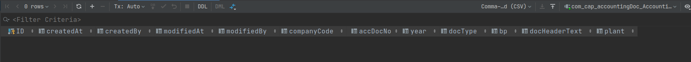
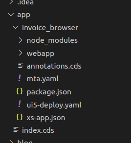

# Notes on using CAP

In this mini series of post I will cover my experiement building a CRUD application using CAP and deploying it on SAP BTP CF.

- CDS Model
- CDS Service
- Fiori Elements
- CAP Authentication & Authorization
- MTA yaml configuration
- Launchpad service
- SAP BTP Role Templates
- Themes and Styles

## Housekeeping

Setting up our development environment, thanks to my colleague @Gunter for pointing me to use VSCode.

The following packages are required for CAP development.

- Install nodejs, I use NVM `https://github.com/nvm-sh/nvm` allows switching between multiple node versions
- Install SQLite
- The command line client and development toolkit for the SAP Cloud Application Programming Model (CAP) `npm i -g @sap/cds-dk`
- `npm i -g mbt --unsafe-perm=true --allow-root`
- `npm i -g mta --unsafe-perm=true --allow-root`
- on VSCode extensions, search for `SAP`,install the following extensions


- SAP HANA Developer Command Line Interface `npm i -g  hana-cli`
- The Cloud MTA Build Tool `npm install -g mbt`
- For windows user you need to have make installed, follow the steps here
[https://sap.github.io/cloud-mta-build-tool/makefile/](https://sap.github.io/cloud-mta-build-tool/makefile/)
-Install MTA CF plugin 

- Add HANA to your project `cds add hana`
cf undeploy <mta-id> deletes an MTA (use cf mtas to find the MTA ID).

Use the optional --delete-services parameter to also wipe service instances.
Caution: This deletes the HDI containers with the application data.

Add the following in the package.json file in the root folder of your project:

```
{
  "cds": {
    "hana" : { "deploy-format": "hdbtable" }
  }
}
```

`cds build`
`cds build --production`

## Project Setup && Layout

- Let's initialize our project using `cds init invoice_sample`

> This will create a default project structure

- Run `npm install`

> Pull all the required libraries, for example sqlite

## The CDS model

Folder **db** we will contain the domain model.

- Create a `schema.cds` file to contain the definitions

Let's start with a simple model of Invoice Header

- AccountingDocumentHeader

```
entity AccountingDocumentHeader {
  CompanyCode   : String(4);
  AccDocNo      : String;
  Year          : Date;
  Vendor        : String(50);
  DocHeaderText : String;
  Plant         : String;
}
```

- Now let's deploy locally with `cds deploy --to sqlite` and examine our table


- AccountingDocumentDetails

```
entity AccountingDocumentDetails {
  CompanyCode   : String(4);
  AccDocNo      : String;
  Year          : Date;
  ItemNo        : Integer;
  DocHeaderText : String;
  Plant         : String;
}
```

## The Service

- Under the **srv** directory create an invoice-service.cds
- add the following service definition to expose the entity

```
using {com.cap.accountingDoc as accountingDoc} from '../db/schema';

service AccountingDocumentService @(path : '/api') {
    entity DocumentHeaderService as projection on accountingDoc.AccountingDocumentHeader;
}
annotate com.cap.accountingDoc.AccountingDocumentHeader with @fiori.draft.enabled;
annotate AccountingDocumentService.DocumentHeaderService with @odata.draft.enabled;
```

- Notice the last two annotations to enable out of the box draft functionality, cool!

## The UI/Fiori Elements

- In VSCode, open the application generator.

> Command Palette/Fiori: Open Application Generator  


- Select SAP Fiori Elements, List Report Objects
- Data Source is local cap project
- Select the service & main entity  

- The new generated directory will look like this  


## Deployment

We will package and deploy using MTA.

- Create `mta.yml` file which contains the services and their associations

- The below section is responsible about the UI
```
  - name: invoice_browser-app-content
    type: com.sap.application.content
    requires:
      - name: invoice_browser_xsuaa
        parameters:
          service-key:
            name: invoice_browser_xsuaa-key

      - name: invoice_browser-html5-repo-host
        parameters:
          service-key:
            name: invoice_browser-html5-repo-host-key

      - name: invoice_browser-destination-service
        parameters:
          content-target: true
    parameters:
      content:
        subaccount:
          destinations:
            - Name: invoice_browser-html5-repo-host
              ServiceInstanceName: invoice_browser-html5-app-host-service
              ServiceKeyName: invoice_browser-html5-repo-host-key
              sap.cloud.service: invoice_browser
            - Authentication: OAuth2UserTokenExchange
              Name: xsuaa_invoice_browser
              ServiceInstanceName: invoice_browser-xsuaa-service
              ServiceKeyName: invoice_browser_xsuaa-key
              sap.cloud.service: invoice_browser
          existing_destinations_policy: update
    build-parameters:
      no-source: true

  - name: invoice_browser_ui_deployer
    type: com.sap.application.content
    path: .
    requires:
      - name: invoice_browser-html5-repo-host
        parameters:
          content-target: true
    build-parameters:
      build-result: resources
      requires:
        - artifacts:
            - comsapaccinvoicebrowser.zip
          name: comsapaccinvoicebrowser
          target-path: resources/

  - name: comsapaccinvoicebrowser
    type: html5
    path: app/invoice_browser
    build-parameters:
      builder: custom
      commands:
        - npm run build
      supported-platforms: [ ]
```
- Service Section
```
  - name: invoice_browser-srv
    type: nodejs
    path: gen/srv
    parameters:
      memory: 128M
      disk-quota: 512M
    requires:
      - name: invoice-db
      # added
      - name: invoice_browser_xsuaa
        parameters:
          service-key:
          name: invoice_browser_xsuaa-key
    provides:
      - name: srv-api
        properties:
          srv-url: ${default-url}
```
- DB section
```
  - name: invoice_browser-db-deployer
    type: hdb
    path: gen/db
    parameters:
      buildpack: nodejs_buildpack
    requires:
      - name: invoice-db
```